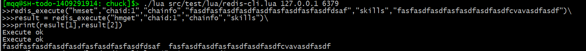

=====================
chuck
=====================
* first, Chuck is my son's name.

* second, Chuck is a high perference,asynchronous and easily use **C/Lua** network library under **Linux/MacOS**.

~~~~~~
build
~~~~~~
download and make  `lua 5.3 <http://www.lua.org/>`_

static library for c:

	make libchuck

dynamic library for lua:

	make chuck.so

~~~~~~~~~~
examples
~~~~~~~~~~
**httpserver.lua**

.. code-block:: lua

	package.path = './lib/?.lua;'
	package.cpath = './lib/?.so;'
	
	local chuck = require("chuck")
	local http = require("http")
	local event_loop = chuck.event_loop.New()
	
	
	
	local ret = http.easyServer(function (request,response)
		response:SetHeader("Content-Type","text/plain")
		response:SetHeader("A","a")
		response:SetHeader("B","b")
		response:AppendBody("hello everyone")
		response:Finish("200","OK")
	end):Listen(event_loop,"0.0.0.0",8010)
	
	if "OK" == ret then
		local timer1 = event_loop:AddTimer(1000,function ()
			collectgarbage("collect")
		end)
		event_loop:Run()
	end

**echo.lua**

.. code-block:: lua

	package.path = './lib/?.lua;'
	package.cpath = './lib/?.so;'
	local chuck = require("chuck")
	local socket = chuck.socket

	local event_loop = chuck.event_loop.New()

	local server = socket.stream.ip4.listen(event_loop,"127.0.0.1",8010,function (fd)
		local conn = socket.stream.New(fd,4096)
		if conn then
			conn:Bind(event_loop,function (data)
				if data then 
					print(data:Content())
					local response = data:Clone()
					response:AppendStr("hello world\r\n")
					conn:Send(response)
				else
					print("client disconnected") 
					conn:Close() 
				end
			end)
		end
	end)

	if server then
		event_loop:Run()
	end

**broadcast_svr.lua**

.. code-block:: lua

	package.path = './lib/?.lua;'
	package.cpath = './lib/?.so;'
	local chuck = require("chuck")
	local socket = chuck.socket
	local packet = chuck.packet

	local event_loop = chuck.event_loop.New()

	local clients = {}
	local client_count = 0
	local packet_count = 0

	local server = socket.stream.ip4.listen(event_loop,"127.0.0.1",8010,function (fd)
		local conn = socket.stream.New(fd,65536,packet.Decoder())
		if conn then
			clients[fd] = conn
			client_count = client_count + 1
			conn:Bind(event_loop,function (data)
				if data then 
					for k,v in pairs(clients) do
						packet_count = packet_count + 1
						v:Send(data)
					end
				else
					client_count = client_count - 1
					print("client disconnected") 
					conn:Close()
					clients[fd] = nil 
				end
			end)
		end
	end)

	local timer1 = event_loop:RegTimer(1000,function ()
		collectgarbage("collect")
		print(client_count,packet_count)
		packet_count = 0
	end)

	if server then
		event_loop:Run()
	end

**broadcast_cli.lua**

.. code-block:: lua

	package.path = './lib/?.lua;'
	package.cpath = './lib/?.so;'
	local chuck = require("chuck")
	local socket = chuck.socket
	local packet = chuck.packet

	local event_loop = chuck.event_loop.New()

	local connections = {}
	local packet_count = 0

	for i=1,500 do
		socket.stream.ip4.dail(event_loop,"127.0.0.1",8010,function (fd)
			local conn = socket.stream.New(fd,65536,packet.Decoder())
			if conn then
			connections[fd] = conn
			conn:Bind(event_loop,function (data)
					if data then 
						packet_count = packet_count + 1
					else
						print("client disconnected") 
						conn:Close()
						connections[fd] = nil 
					end
				end)
			end
		end)
	end

	local timer1 = event_loop:RegTimer(1000,function ()
		print(packet_count)
		collectgarbage("collect")
		packet_count = 0
	end)

	local timer2 = event_loop:RegTimer(300,function ()
		for k,v in pairs(connections) do
			local buff = chuck.buffer.New()
			local w = packet.Writer(buff)
			w:WriteStr("hello")
			v:Send(buff)
		end
	end)

	event_loop:Run()

**a simple interactive redis client**

.. code-block:: lua

	package.cpath = 'lib/?.so;'

	local chuck = require("chuck")
	local event_loop = chuck.event_loop.New()
	local redis = chuck.redis
	local redis_conn

	function redis_execute(cmd,...)
		local result = nil
		local execute_return = false
		local ret = redis_conn:Execute(function(reply,err)
			if not err then
				print("Execute ok")
			else
				print("Execute error:" .. err)
			end
			result = reply
			execute_return = true
		end,cmd,...)
		
		if not ret then
			while not execute_return do
				event_loop:Run(100)
			end

			return result
		else
			print("Execute error:" .. ret)
			return nil
		end
	end

	local function do_command(str)
		local func = load(str)
		if func then
			func()
		end
	end

	local function read_command()
		local chunk = ""

		local prompt = ">>"

		while true do
			local cmd_line = chuck.Readline(prompt)
			if #cmd_line > 1 then
				if string.byte(cmd_line,#cmd_line) ~= 92 then
					chunk = chunk .. cmd_line
					break
				else
				  	chunk = chunk .. string.sub(cmd_line,1,#cmd_line-1) .. "\n"
					prompt = ">>>"
				end
			else
				break
			end	
		end

		if chunk ~= "" then
			do_command(chunk)
		end
	end

	if arg == nil or #arg ~= 2 then
		print("useage:lua redis-cli.lua ip port")
	else
	   local ip,port = arg[1],arg[2]
	   local stop
	   redis.Connect_ip4(event_loop,ip,port,function (conn)
	   	redis_conn = conn
	   	stop = true
	   	if not redis_conn then
	   		print(string.format("connect to redis server %s:%d failed",ip,port))
	   	else
	   		print("hello to redis-cli.lua! use \\ to sperate mutil line!")
	   	end
	   end)

	   while not stop do
	   	event_loop:Run(100)
	   end

	   while redis_conn do
	   		read_command()	
	   end
	end

~~~~~~~~
customer
~~~~~~~~

